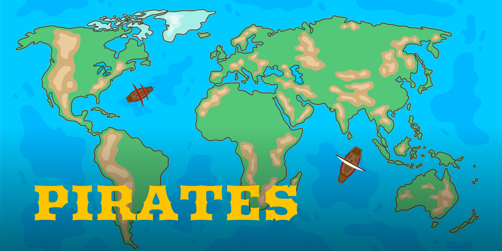
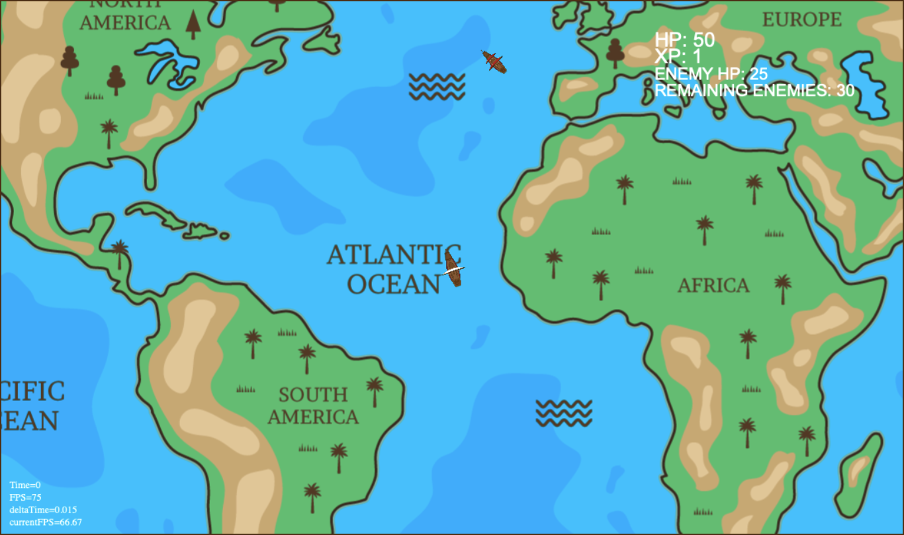
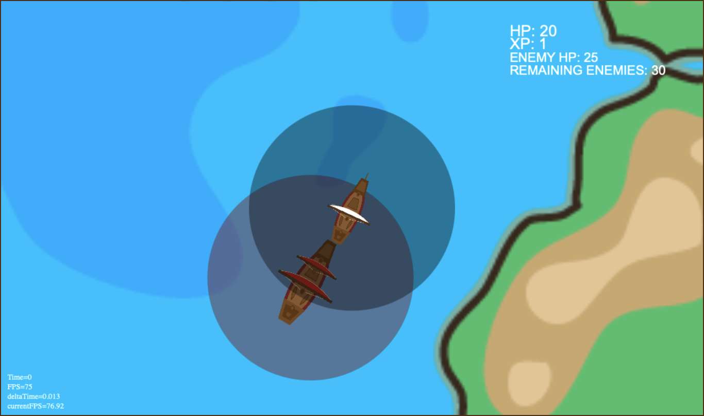

  

# Pirates Game

**Pirates Game** is a web based project that uses the HTML canvas to display a pirate battleship game. 
The game allows the player to navigate the oceans of the world while looking for enemies to destroy.

## Features

- **Navigation** modes:
    - Fast travel (zoomed out)
    - Default navigation
    - Battle mode (zoomed in)
- **Enemies** spawn near different continents

## Screenshots

  
  

## Future Features

At the moment, there are no plans to introduce any new features.

## Requirements

This version of the game works on the browser but only on desktop, not mobile browsers.

## License

This project is licensed under the MIT License.

#

**Pirates Game** is an open-source project developed by Javier Iregui, 2022.